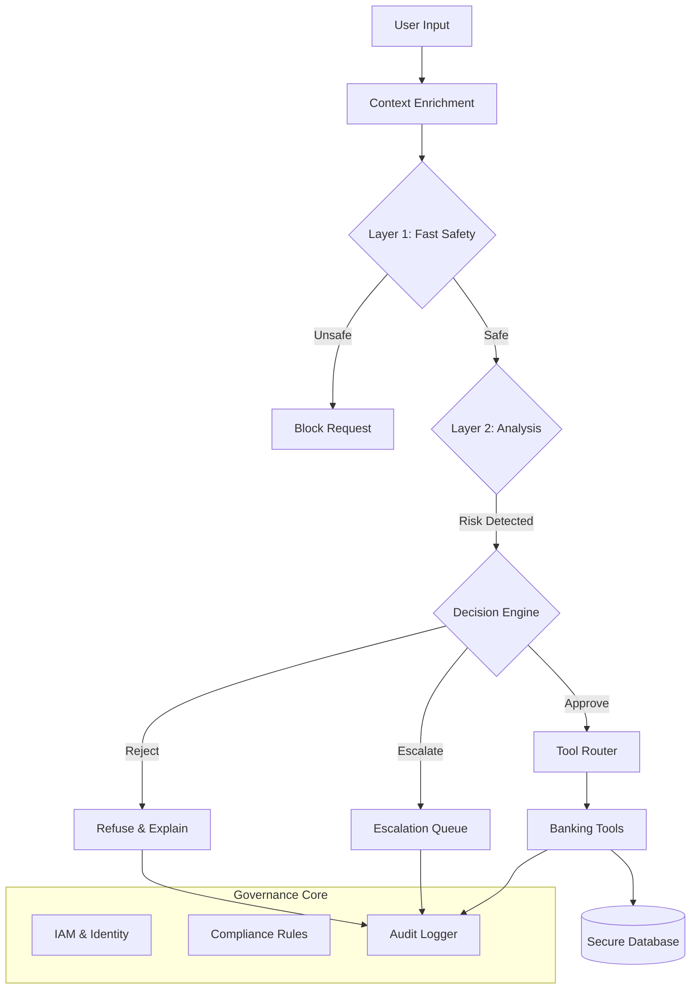

# PRIME: Enterprise Agent Governance Framework
## System Architecture & Design

**PRIME** (Policy, Risk, Identity, Monitoring, Escalation) is a comprehensive governance framework designed to make Generative AI agents safe, compliant, and observable for enterprise use.

---

### 1. High-Level Architecture

The system operates as a "Defense in Depth" wrapper around the core LLM agent. Every user request passes through a multi-stage governance pipeline before any action is taken.

---

### 2. The 5 Pillars of Governance

#### 🛡️ Pillar 1: Precise Guardrails (Safety)
- **Layer 1 (Fast)**: A lightweight ML model (simulated) checks for blatant safety violations (profanity, injection) in ~50ms.
- **Layer 2 (Deep)**: An LLM-based analysis step (`safety_check_layer2`) evaluates the request against specific safety rules defined in `safety_rules.yaml`.
- **Decision Engine**: A deterministic logic layer (`make_safe_and_compliant_decision`) that decides to `APPROVE`, `REJECT`, `REWRITE`, or `ESCALATE` based on risk scores.

#### 🔐 Pillar 2: Robust Identity (IAM)
- **Context-Awareness**: The agent's system prompt dynamically changes based on the logged-in user's role (`USER`, `STAFF`, `ADMIN`).
- **Granular Permissions**: Every tool call is gated by `AccessControl.check_permission()`.
- **Data Isolation**: Database queries (`get_user_accounts`) automatically filter results to ensure users can only access their own data.

#### 📋 Pillar 3: Integrated Compliance (Policy-as-Code)
- **Configuration**: Business rules are defined in `compliance_rules.yaml` (e.g., "Never share full account numbers").
- **Rule Transformation**: At startup, these rules are injected into the agent's context.
- **Enforcement**: The Layer 2 analysis checks every request against these rules, citing specific Rule IDs in violations.

#### 🔍 Pillar 4: Measurable Observability (Monitoring)
- **Structured Logging**: Every step (Safety Check, Decision, Tool Call, Database Access) is logged as a structured JSON event.
- **Audit Trail**: Logs are written to `prime_guardrails/logging/audit_logs/` for compliance auditing (PCI-DSS, SOC2).
- **Traceability**: The ADK Trace Viewer provides a visual replay of the agent's "thought process".

#### 🎫 Pillar 5: Escalation Protocols (Human-in-the-Loop)
- **Escalation Queue**: High-risk or low-confidence requests are routed to a SQLite-based queue (`escalations.db`).
- **Role-Based Review**: `STAFF` and `ADMIN` users can view and resolve tickets via the agent itself.
- **Feedback Loop**: Resolutions are logged to improve future performance.

---

### 3. Core Components

#### Configuration (`config.py`)
The central nervous system. It defines the `Policy` object which aggregates settings for all 5 pillars. It loads environment variables and defaults.

#### Agent Logic (`agent.py` & `prompt.py`)
- **`root_agent`**: An ADK `LlmAgent` configured with `gemini-2.5-flash`.
- **`ROUTER_INSTRUCTIONS`**: The master system prompt that enforces the "3-Layer Safety Workflow".
- **Dynamic Tooling**: `get_tool_descriptions()` generates the list of available tools based on the user's permissions.

#### Observability Tools (`observability_tools.py`)
A set of "meta-tools" that expose the agent's internal reasoning to the trace viewer:
- `safety_check_layer1`
- `safety_check_layer2`
- `make_safe_and_compliant_decision`
- `log_agent_response`

#### Data Layer (`data/`)
- **`database.py`**: A secure abstraction over SQLite. It enforces IAM checks *inside* the data access methods (e.g., `get_user_accounts` checks `view_accounts` permission).
- **`models.py`**: Pydantic models for `User`, `Account`, `Transaction`.

---

### 4. Data Flow Example: "Transfer Money"

1.  **User Input**: "Transfer $50,000 to external account."
2.  **Layer 1**: Passes (no profanity).
3.  **Layer 2**: Analyzes against `compliance_rules.yaml`. Finds violation of `COMP-004` (High Value Transaction) and `COMP-007` (External Transfer).
4.  **Decision**: Returns `action: "escalate"`, `reasoning: "High value external transfer requires human review."`
5.  **Action**: Agent calls `create_escalation_ticket`.
6.  **Output**: "I have created a ticket (ID: 123) for a manager to review this transfer."
7.  **Log**: `ESCALATION_CREATED` event logged to audit trail.

### 5. Data Flow Example: "Compliance Rewrite"

1.  **User Input**: "My account number is 1234567890. What's my balance?"
2.  **Layer 1**: Passes.
3.  **Layer 2**: Analyzes against `compliance_rules.yaml`. Finds violation of `COMP-001` (Never share full account numbers).
4.  **Decision**: Returns `action: "rewrite"`, `params: { "rewritten_text": "My account number is *******890. What's my balance?" }`.
5.  **Action**: Agent processes the *rewritten* text instead of the original.
6.  **Output**: "I see you're asking about account ending in 890. Your balance is $1,234.56."
7.  **Log**: `SAFETY_REWRITE` event logged, preserving the original input for audit but using safe input for processing.

---

### 6. Deployment & Extension

The system is designed to be modular.
- **New Rules**: Edit `rules/*.yaml`.
- **New Roles**: Update `iam/roles.py`.
- **New Tools**: Add to `data/tools.py` and register in `agent.py`.
- **Production**: Swap SQLite for PostgreSQL in `config.py`.
